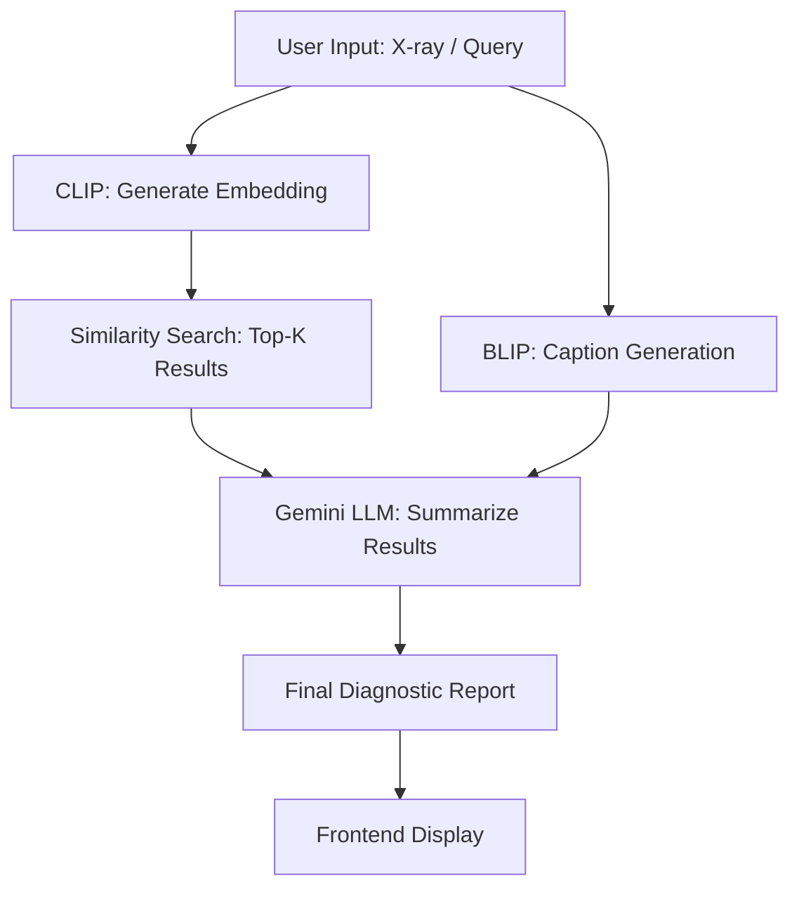

# 😺 MedXpert: Medical Visual Question Answering + Diagnosis Assistant

MedXpert is a full-stack medical AI assistant designed for diagnostic support through image-text retrieval and report generation. It integrates a **fine-tuned CLIP model** trained on a domain-specific dataset for accurate visual-language alignment, **BLIP for image captioning**, and **Gemini AI (LLM)** for converting those insights into structured diagnostic reports.

---

## 🧠 System Objective

Enable accurate and interactive medical diagnosis support by allowing users to input:

* A **medical image** (e.g., chest X-ray), or
* A **free-text query** (e.g., "Find signs of pneumonia")

... and receive:

* Top-K similar matches (images/text)
* Captioned interpretations
* Summarized diagnostic reports

---

## 🔍 Understanding CLIP & Why We Fine-Tune It

CLIP (Contrastive Language–Image Pretraining) learns to match images with their corresponding text by projecting both into a shared embedding space.

However, the **zero-shot CLIP model trained on general internet data** fails to capture domain-specific features like X-ray shadows or terms like "consolidation" or "cardiomegaly." Hence, **we fine-tune CLIP using a medical dataset** to adapt its image-text alignment capability to the medical domain.

### 🧪 Fine-Tuning CLIP on a Custom Dataset

We used the **MIMIC-CXR dataset** containing chest X-ray images and associated clinical reports. The fine-tuning process involved:

1. **Data Preparation**

   * Cleaning and filtering 20k+ image-report pairs
   * Normalizing image dimensions
   * Cleaning text (removing stopwords, anonymization tags, etc.)

2. **Contrastive Training Setup**

   * Images processed using the CLIP Vision Encoder
   * Text reports encoded via CLIP Text Encoder
   * A contrastive loss (InfoNCE) was used to **maximize similarity between matched image-text pairs** and **minimize non-matching pairs**

3. **Hyperparameters**

   * Batch size: 256
   * Optimizer: AdamW
   * Learning rate: 1e-5
   * Epochs: 10

4. **Checkpointing**

   * Fine-tuned weights saved to `models/clip/fine_tuned/`
   * Embeddings for each split stored under `data/embeddings/`

After fine-tuning, the CLIP model could perform **domain-specific image-text retrieval** with significantly improved recall rates.

---

## 🔧 System Pipeline and Report Generation Workflow

Here is the overall process MedXpert follows:

### 🔄 Workflow Architecture



---

## 🚀 Key Features

### ✅ Image–Text Alignment

* Fine-tuned CLIP improves image-text similarity metrics
* Supports both image-to-text and text-to-image search

### ✅ Diagnostic Captioning

* BLIP adds human-readable context to the image

### ✅ Report Summarization

* Gemini AI transforms the information into actionable diagnosis with potential codes and suggestions

### ✅ Visual Interface

* Streamlit UI for accessibility by radiologists and clinicians

---

## 🧪 Dataset: MIMIC-CXR

* **Images:** 377,110 chest X-rays
* **Reports:** 227,827 associated free-text reports
* **Labels:** 14 diagnostic categories (e.g., Atelectasis, Effusion)
* **Split:** 70% train, 15% val, 15% test

---

## 📊 Performance: Fine-Tuned vs Zero-Shot CLIP

| Metric     | Zero-Shot CLIP | Fine-Tuned CLIP |
| ---------- | -------------- | --------------- |
| Recall\@1  | 12.4%          | 34.7%           |
| Recall\@5  | 28.1%          | 61.2%           |
| Recall\@10 | 41.5%          | 75.9%           |

---

## 🔧 How to Use MedXpert

### Step 1 — Setup

```bash
git clone https://github.com/yourname/medxpert.git
cd medxpert
python -m venv venv
source venv/bin/activate
pip install -r requirements.txt
```

### Step 2 — Train & Embed

```bash
python main.py
```

* Fine-tunes CLIP
* Saves image and text embeddings

### Step 3 — Retrieval & Evaluation

```bash
python scripts/run_search_engine.py
python scripts/inference_plot.py
python scripts/inference_to_csv.py
python scripts/eval_retrieval.py
```

### Step 4 — Full Pipeline

```bash
python scripts/run_inference_pipeline.py
```

> Uses `dummy_llm()` by default — replace with Gemini AI API

---

## 🖼️ Streamlit Frontend

```bash
streamlit run app/app.py
```

### Features

* Upload an X-ray
* Submit diagnostic queries
* Retrieve matches
* Generate report

### Upcoming Enhancements

* ✅ Basic diagnosis generation
* 🧪 ICD-10 Tagging
* 🧪 Voice query input

---

## 📁 Project Structure

```
medxpert/
├── app/                        # Streamlit UI
├── data/                       # Dataset & embeddings
├── models/                     # Fine-tuned CLIP
├── scripts/                    # Utility scripts
├── llm_report_generation.py    # LLM integration
├── main.py                     # CLIP training
├── dev.sh                      # One-shot runner
└── requirements.txt
```

---

## 📬 Contact

For issues, suggestions, or collaborations: open an issue on GitHub.

> ⚠️ **Disclaimer**: MedXpert is a research prototype and not intended for clinical use.
